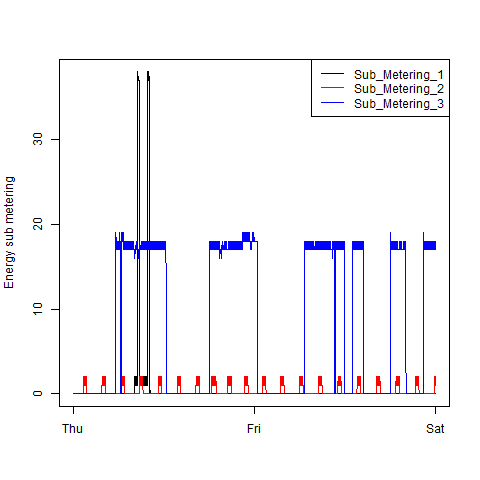
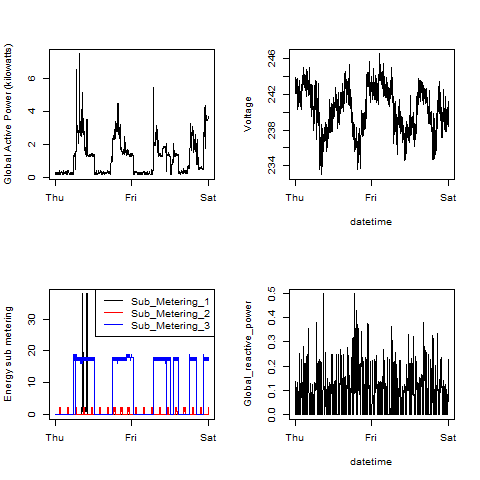

## Instructions
Source Project1.R into the work space then call runAll()

Note:  
The code is somewhat terse, I deleted it all with a git reset 1 hour before the due time and had to regenerate it from memory! 

The four plots I constructed are shown below. 

### Plot 1
 

### Plot 2
 

### Plot 3
 

### Plot 4
 

